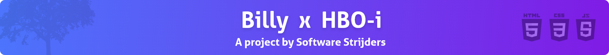

# Project Frontend development

## Inhoudsopgave

- [Het team](#het-team)
- [Introductie](#introductie)
- [Git strategie](#git-strategie)
- [Scrum](#scrum)
- [Documentatie](#documentatie)
  - [Visie/Scope document](#visiescope-document)
  - [Functioneel ontwerp](#functioneel-ontwerp)
- [Git](#git)
- [Codebase](#codebase)
- [Installatie](#installatie)
- [Gebruikersinstructies](#gebruikersinstructies)

## Het team

Dit project wordt gemaakt door een groep van vijf, elke met zijn eigen sterktes en zwaktes die elkaar complementeren.

Het groepje bestaat uit de volgende mensen:

- Xander Vedder ([@xandervedder](https://github.com/xandervedder))
- Jort Willemsen ([@JortWillemsen](https://github.com/JortWillemsen))
- Milan Dol ([@JustMilan](https://github.com/JustMilan))
- Ruben van den Brink ([@Rubenvdbrink](https://github.com/Rubenvdbrink))
- Arjen Norbart ([@arjennorbart](https://github.com/arjennorbart))

## Introductie

Dit project zal worden gebruikt als een wiki voor alle HBO-i aangesloten hogescholen in Nederland.

Het heeft de volgende eisen:

- Het moet een wiki worden waar de pagina's bewerkt kunnen worden.
- Pagina's moeten alleen door ingelogde gebruikers bewerkt kunnen worden.
- De wiki moet doorzocht kunnen worden.
- De wiki moet (HBO-i) categoriëen hebben.
- De wiki moet open-source zijn.
- De wiki moet voldoen aan de toegangelijksheid-eisen.
- De wiki moet demonstreerbaar snel zijn waardoor er zo min mogelijk energie wordt gebruikt.

## Git strategie

Voor onze Git strategie gebruiken we een gemodificeerde versie van `git flow`. In onze strategie gebruiken we de volgende branches:

- `Main branch`
- `Development branch`
- `Feature branches`

Wat op de `main` branch staat, zal op Heroku gaan draaien. Op de `main` branch staat alleen stabiele werkende code. Dit wordt stabiel gehouden door aan het eind van de sprint de `development` branch te mergen met de `main` branch. Deze krijgt dan een versie op de laatste commit, dit wordt met `git tag` gedaan.

Al het ontwikkel werk wordt in de `development` branch gemerged d.m.v. Pull Requests in Github. Dit wordt gedaan om de master branch zo stabiel mogelijk te houden.

Voor elke `Task` of `User story` worden `feature` branches aangemaakt, hierdoor heeft ieder teamlid zijn eigen branch waar die alles in kan doen (ongestoord). Met deze `feature` branches worden uiteindelijk Pull Requests gedaan. Op de Pull Requests worden minimaal 2 reviewers gevraagd om het na te kijken. Deze reviews zorgen ervoor dat de kwaliteit van de code hoog blijft.

## Scrum

Dit project maakt gebruik van een Agile workflow, waarvan de Scrum methode wordt geïmplementeerd. Dit wordt gedaan door in Github gebruik te maken van [projects](https://github.com/HU-SD-SV2PRFED-studenten-2021/prfed_2021-V2B-1/projects).

Per sprint hebben we een bord waar we kaarten in hebben gezet. Deze kaarten kunnen in verschillende lanes worden gesleept. We hebben de volgende lanes:

- `Backlog` (gedeelt tussen de verschillende sprints)
- `To Do`
- `In progress`
- `Done` (geautomatiseerd)

De meeste User Stories zijn al in de `Backlog` gezet. Deze User Stories hebben weer `Task`'s die bij die User Stories horen, dit doen we om de User Stories behapbaar te maken.

We geven de `Task`'s daarom ook punten zodat we als team weten hoeveel moeite er in gestoken moet worden.

## Documentatie

In dit kopje worden alle zaken omtrent documentatie opgenoemd.

### Visie/Scope document

<!-- TODO: Add proper link -->

Het Visie/Scope document is [hier](/documentation/visie-scope-document.pdf) te vinden.

### Functioneel ontwerp

<!-- TODO: Add proper link -->

Het Functioneel ontwerp document van Sprint 1 is [hier](/documentation) te vinden.

## Git

Om de commits zo duidelijk mogelijk te houden, volgen we "tips" van dit [artikel](https://chris.beams.io/posts/git-commit/).

Om onze Git history zo schoon mogelijk te houden, gebruiken we in de feature branches geen `git merge`. In plaats daarvan, gebruiken we `git rebase`. Er wordt alleen vanaf Github gemerged. Zo wordt ervoor gezorgd dat er alleen branches _in_ `development` worden gemerged, en niet andersom.

## Codebase

Om de kwaliteit van de code base zo hoog mogelijk te houden, maken we als team gebruik van [prettier](https://prettier.io/). Dit zorgt ervoor dat al onze code op dezelfde lijn gehouden wordt, waardoor verschillen in formatting niet aanwezig zijn.

De root directory van de codebase is [hier](/src) te vinden.

## Installatie

<!-- TODO: make this -->

## Gebruikersinstructies

<!-- TODO: make this -->
