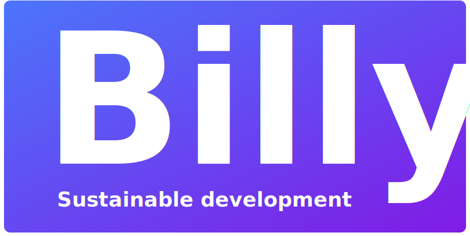

# Project Frontend development

## Table of Contents
- [Project Frontend development](#project-frontend-development)
  * [The team](#the-team)
  * [Introduction](#introduction)
  * [Git strategy](#git-strategy)
  * [Scrum](#scrum)
  * [Code of Conduct](#code-of-conduct)
    + [Git](#git)
    + [Code style](#code-style)
  * [Screenshots](#screenshots)
  * [Tech/framework used](#tech-framework-used)
  * [Features](#features)
  * [Installation](#installation)
  * [Tests](#tests)

## The team

This project will be made by a group of five, each with their different strenghts and weaknesses that complement 
eachother

The team has the following members:

* Xander Vedder ([@xandervedder](https://github.com/xandervedder))
* Jort Willemsen ([@JortWillemsen](https://github.com/JortWillemsen))
* Milan Dol ([@JustMilan](https://github.com/JustMilan))
* Ruben van den Brink ([@Rubenvdbrink](https://github.com/Rubenvdbrink))
* Arjen Norbart ([@arjennorbart](https://github.com/arjennorbart))

## Introduction

This project will turn out as a wiki for all HBO-I educations in the Netherlands. 
It will have to meet the following requirements at least:
* It has to be a wiki whose pages can be edited
* Pages can only be edited by logged in users
* The wiki must be searchable
* The wiki must be able to be categorized by HBO-I category and by role
* The wiki must fit in the structure of HBO-I
* The wiki software should preferably be open source and easy to use
* The wiki must meet accessibility requirements
* The wiki must load demonstrable quickly so that as little energy as possible is used.
* The wiki must meet the requirements of HBO-I

## Git strategy

For our git strategy, we are using a modified version of git flow. In our strategy we use the following branches:

- `Master branch`
- `Development branch`
- `Feature branches`

Whatever is in the master branch, will be running on Heroku. The only things that will go in the master branch are releases, accompanied by `git tag` tags (v1, v2, etc.). There is a release at the end of every iteration ~ every week.

All of the development work will be done in the `development` branch. This is to ensure that the deployed version (`master` branch) will always remain stable.

For every story or (sub)task we create a new `feature` branch, each team member can do whatever he wants in this branch (rebasing, force pushing, all of it). These `feature` branches will be used to make Pull Requests in Github. In these PR's there will be regular reviews to ensure high code quality.

## Scrum

This project will make use of the Agile workflow, implementing the Scrum method. This can be seen from our project [boards](https://github.com/huict/prbed-2021-v2b-1/projects). There is a different board for each iteration (1-3).

Currently we use the following lanes:

- `Backlog` (shared between iterations)
- `To Do`
- `In progress`
- `Done` (automated)

We have added all the different types of User Stories located in our backlog, however, each different User Story also has Sub Tasks related to that particular User Story. This way, we can assign different team members to the sub tasks.

We have also given all the sub tasks points, so we've already thought about how long a task would take and/or if it has high complexity.

## Code of Conduct

This paragraph is primarily meant for the team, but it can give insights as to how we're keeping the quality of the code up.

### Git

This has been discussed many times by other people, thus it is only natural to link a clear and concise article about this topic:

https://chris.beams.io/posts/git-commit/

The points mentioned in this article are the ones we should be using for making clear git messages.

To keep our git history clean, we don't use the `git merge` command by ourselves, instead, we rebase our `feature` branches. No unnecessary merges from `development` to `feature/...`, only merges from the PR's in `development`.

### Code style

## Screenshots

## Tech/framework used

## Features

## Installation

## Tests
